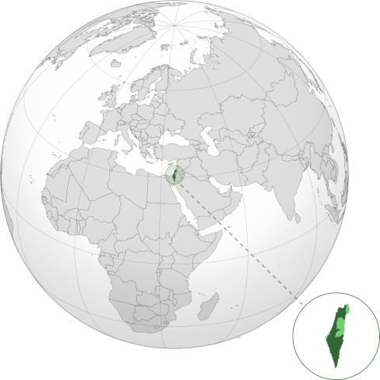

# Map Israeli Tech Companies Repository

## Welcome to the Map Israeli Tech Companies repository!

This GitHub project aims to create a comprehensive map of Israeli tech companies, providing a valuable resource for entrepreneurs, investors, and technology enthusiasts. 

Israel has a thriving tech industry, with a wide range of innovative companies operating in various sectors such as cybersecurity, artificial intelligence, biotechnology, and more. This repository serves as a collaborative platform for collecting, organizing, and visualizing information about these companies, showcasing their contributions and fostering connections within the community.

## How to Contribute

As a contributor to this repository, you can help expand and update the map of Israeli tech companies by:

- Adding new companies
- Providing essential details such as industry, location, founding date, funding rounds, notable products/services, etc.
- Improving data accuracy
- Adding relevant tags and categories
- Creating visualizations to enhance the overall user experience

Whether you're an experienced developer, a tech enthusiast, or someone passionate about Israeli innovation, your contributions are highly valued and appreciated. Let's come together and build the most comprehensive and up-to-date map of Israeli tech companies right here on GitHub.

## Get Started

To get started, follow these steps:

1. Fork this repository.
2. Make your changes and additions.
3. Submit a pull request.

Join us in mapping the dynamic Israeli tech landscape, and let's showcase the incredible achievements happening in the Israeli technology sector!

We look forward to your involvement and appreciate your support.

Happy mapping!
